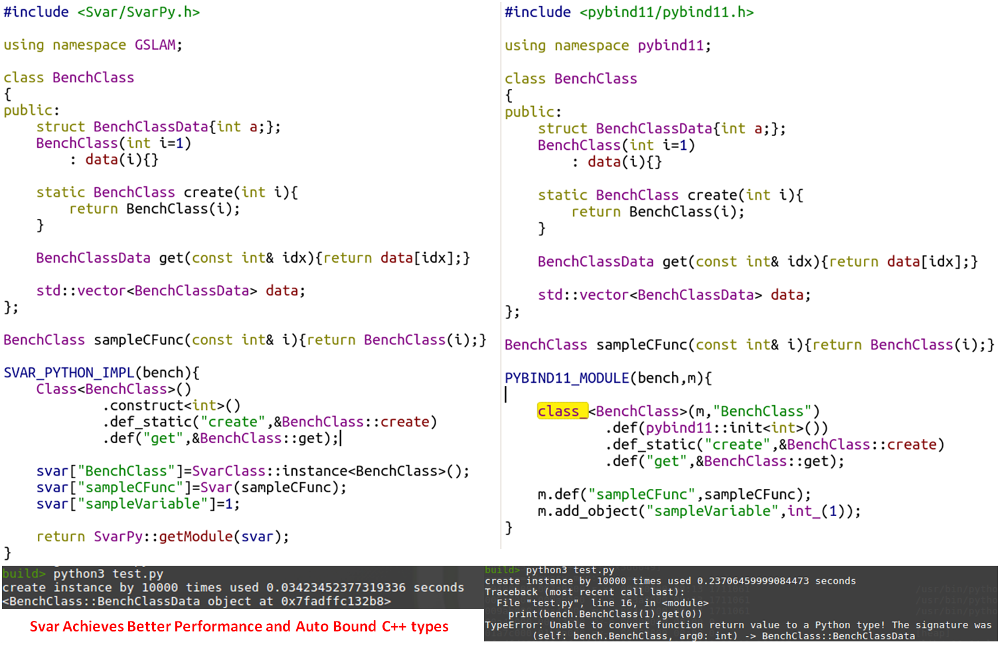

# Svar, A Tiny Modern C++ Header Brings Unified Interface for Different Languages

---

[](https://travis-ci.org/zdzhaoyong/Svar)
[](https://circleci.com/gh/zdzhaoyong/Svar)
[](https://www.codacy.com/app/zdzhaoyong/Svar)
[](./LICENSE)
[](https://github.com/zdzhaoyong/Svar/releases)

---

# 1. Why Svar? 

By Using Svar, your C++ library can be called easily with different languages like C++, Java, Python and Javascript.

Svar brings the following features:
1. A dynamic link library that can be used as a module in languages such as C++, Python, and Node-JS;
2. Unified C++ library interface, which can be called as a plug-in module. The released library comes with documentation,  making *.h header file interface description unnecessary;
3. Dynamic features. It wraps variables, functions, and classes into Svar while maintaining efficiency;
4. Built-in Json support, parameter configuration parsing, thread-safe reading and writing, data decoupling sharing between modules, etc.

## 1.1. Svar vs pybind11

Here is a small [benchmark](./src/python/benchmark/test.py) between Svar and pybind11 to demonstrate some differences.



1. More elegent, more light-weighted, more efficient.
2. Svar auto support everything, while pybind11 need to declare every used classes.
3. The Svar module not needed to have python dependency and support different version of python at the same time.


## 1.2. Svar vs nbind

TODO

## 1.3. Svar vs Old Style C++ Libraries


According to [Dynamic C++ Proposal](https://www.codeproject.com/Articles/31988/Dynamic-C-Proposal). Dynamism brings several advantages, some of these are:

* More abstraction (no FBC).
* Easy framework development.
* Easy scripting language integration.
* Independent external objects.
* Generic compiled code (discussed later).
* Faster compiling (discussed later).
* Less ugly C++ hacks.

Svar use modern C++ features and brings language level dynamism based on c++11 standard.

1. High level dynamic features. Variables, functions, and classes are all treated as Svar object.
2. The Svar module library explains itself, no extra headers needed anymore. Just call c++ functions like python!
3. Built-in Json support, parameter configuration parsing, thread-safe reading and writing, data decoupling sharing between modules, etc.
4. Only one single header less than 5k lines used, very easy to use.


## 1.4. Svar vs Original JNI

Since Svar treat any C++ things as Svar object, we only need to provide a JNI interface for Svar class to acess anything else in C++ libraries.
We now provides a demo project shows how to [access c++ libraries in Java using Svar](./src/java/SvarAndroid). 


# 2. Usage

## 2.1. Obtain source code from github

```
git clone https://github.com/zdzhaoyong/Svar
```

## 2.2. C++ Users

Compile the source code with cmake:
```
cd Svar
mkdir build
cd build
cmake .. -DCMAKE_BUILD_TYPE=Release
make
sudo make install
```

Usage help:
```
svar --help
```

Perform tests:
```
svar -tests
```

Show the context of the sample plugin module:

```
# Show the structure of a plugin
svar -plugin libsample_module.so
# Show the documentation of a named class
svar -plugin libsample_module.so -name __builtin__.Json
# Show the documentation of a named function
svar -plugin libsample_module.so -name add
```

Use sample plugin module with c++: [sample_use](./src/cpp/sample_use).

## 2.3. Python Users

Install svar using pip:
```
# python2
sudo pip install Svar
# python3
sudo pip3 install Svar
```

Use with existed svar sample module:
```
import svar
# Show the help of the svar module
help(svar)
# Import a svar module as a python module
sample=svar.load("libsample_module.so")
# Show the help of sample module
help(sample)
result=sample.add(2,3)
```

## 2.4. Node-JS Users

Install svar using npm:
```
npm install Svar
```

Use with existed svar sample module:
```
svar=require("svar")
# Import a svar module as a js module
sample=svar.load("libsample_module.so")
result=sample.add(2,3)
```


